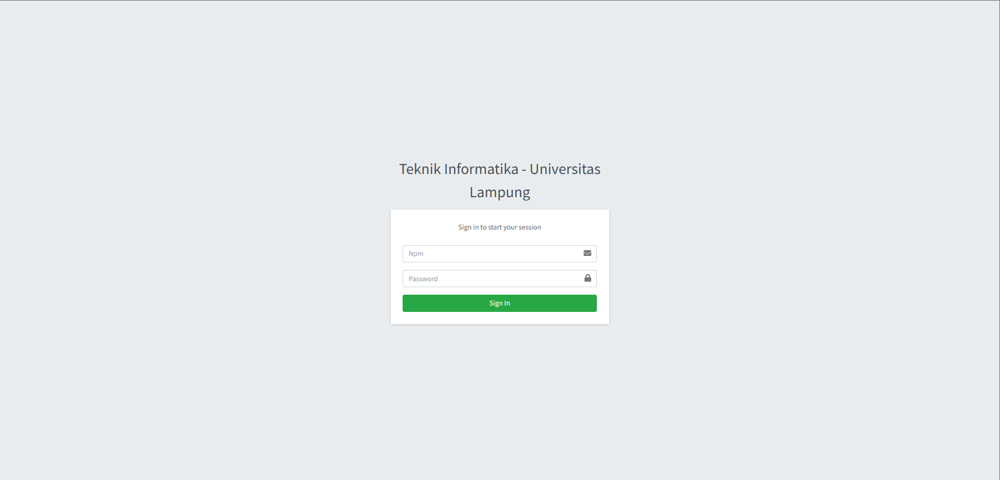
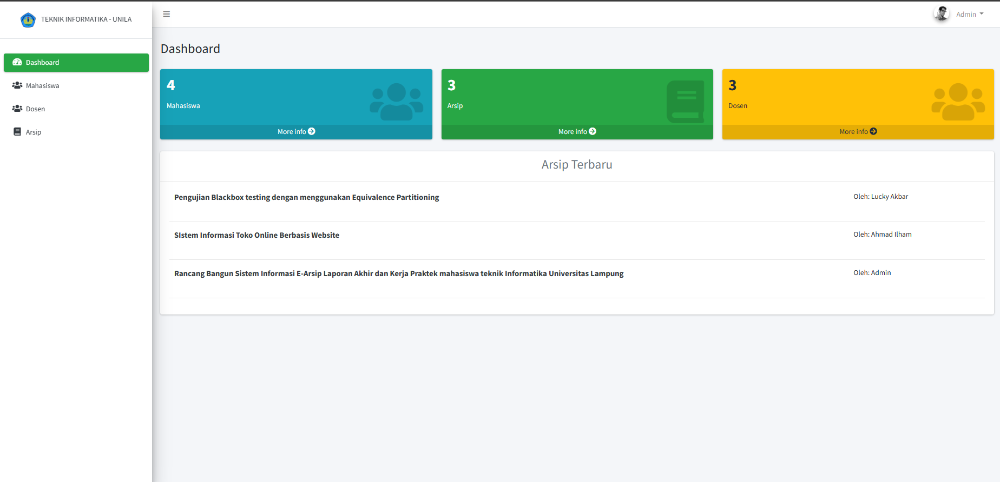
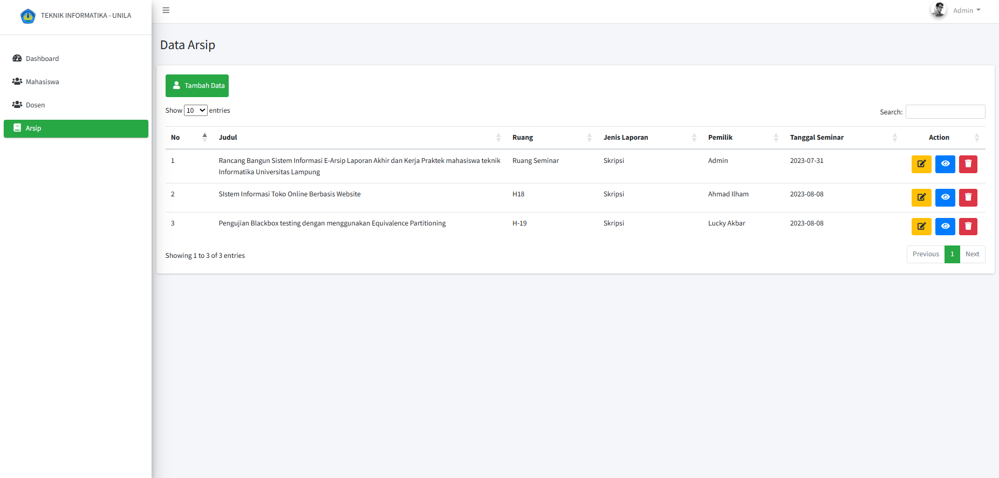

# Sistem Informasi E-Arsip

Selamat datang di repositori Sistem Informasi E-Arsip. Repositori ini berisi kode dan dokumentasi terkait dengan pengembangan dan implementasi sistem informasi elektronik arsip.

## Deskripsi

Sistem Informasi E-Arsip merupakan platform berbasis web yang bertujuan untuk mengelola dan menyimpan arsip dokumen secara elektronik. Dengan menggunakan sistem ini, Anda dapat dengan mudah mengatur, mencari, dan mengakses dokumen-dokumen penting tanpa perlu bergantung pada arsip fisik.

## Fitur Utama

-   Penyimpanan Dokumen Elektronik
-   Pencarian dan Pemfilteran Dokumen
-   Manajemen Izin Akses
-   Riwayat Revisi Dokumen

## Panduan Penggunaan

1. Clone repositori ini ke mesin lokal Anda.
2. Instal Dependensi: Buka terminal atau command prompt, arahkan ke direktori proyek Laravel yang baru saja Anda kloning, dan jalankan perintah berikut untuk menginstal semua dependensi yang diperlukan: `composer install`.
3. Buat Salinan File .env: Dalam direktori proyek, buat salinan file .env.example dan ubah namanya menjadi .env. File .env berisi pengaturan konfigurasi untuk aplikasi Laravel, termasuk pengaturan database.
4. Generate Kunci Aplikasi: Di terminal, jalankan perintah berikut untuk menghasilkan kunci aplikasi unik: `php artisan key:generate`.
5. Konfigurasi Database: Buka file .env yang baru saja Anda buat dan konfigurasikan pengaturan database sesuai dengan lingkungan Anda. Atur DB_CONNECTION, DB_HOST, DB_PORT, DB_DATABASE, DB_USERNAME, dan DB_PASSWORD sesuai dengan pengaturan database lokal Anda.
6. Jalankan Migrasi Database: Jalankan migrasi database untuk membuat tabel-tabel yang diperlukan: `php artisan migrate`.
7. Jalankan Aplikasi: Setelah langkah-langkah di atas selesai, Anda dapat menjalankan aplikasi Laravel dengan perintah: `php artisan serve`.
8. Buka Aplikasi di Browser: Buka browser dan akses URL yang ditampilkan oleh perintah php artisan serve, biasanya http://127.0.0.1:8000.

  
